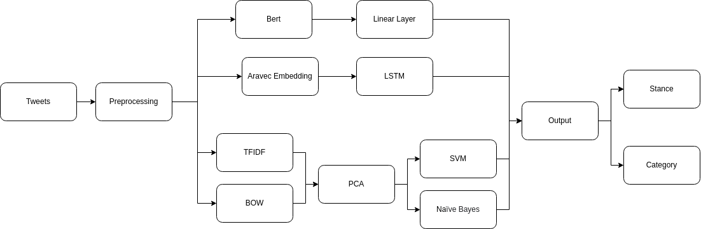

# Stance and Category Detection for Arabic COV-19 Tweets.

The project aims to analyze people's opinions and feelings about the COVID-19 pandemic and vaccines using Twitter data. 
The focus is on Arabic tweets related to COVID-19 vaccinations, which may contain different types of content, including rumors, advice, and information authentication.The project's goal is to build natural language processing (NLP) models to detect the stance towards vaccination and the content type of the tweet.

## Dataset 🗃️
The training set contains 6988 samples, the dev set contains 1000 samples, and the test set contains 2000 samples. The stance detection labels represent whether the tweet author encourages and supports vaccination (Positive), refuses vaccination (Negative), or is neutral (Neither supports nor refuses vaccination). The category labels represent different types of tweet content, including information and news about vaccination, celebrities taking vaccinations ... etc

# Project Pipeline ♻️

## Preprocessing 🧐

Methods used for preprocessing: 

1- Remove Diacritization التشكيل  
2- Remove Repeated characters جمييل  
3- Remove links  
4- Limit duplicated emojis to 2 emojis  
5- Remove English words  
6- Remove Numbers  
7- Remove Punctuation  
8- Tokenize the tweet  
9- Remove Stop-words  

## Feature Extraction 🏗️

1- Pre-trained Embeddings (AraVec Twitter-CBOW) 
    AraVec is a pre-trained word embedding which was pre-trained on tweeter tweets, it has vocabulary size of 1,259,756, which we used to represent the words (and even emojis) in the form of a real-valued vector and that allows to encode the meaning of the word such that the words that are closer in the vector space are expected to be similar in meaning. 

2- TF-IDF (term-frequency, inverse document frequency)
    Given a list of tweets, we construct a term-document matrix using TFIDF. This is to penalize frequent words like “على” and “من” Thus, each row represents a document vector. Its length is the same as the number of vocabulary words. So, we apply PCA to represent documents using the most discriminating words and make training faster. 

3- BOW (Bag of words)
    It is the same as TF-IDF, but the matrix just holds real counts of words in documents. Also, it is fed into PCA to reduce dimensionality. 

## Model Training 🚸

1- BERT (AraBERT) + Linear Layer 
    AraBERT is a pre-trained transformer-based model, which allows to generate contextual word (and even emojis) embeddings meaning that the same word can have different representations for different contexts, it was also fined-tuned on our training set to get better performance, then passing that contextual embeddings to a linear layer followed by a SoftMax layer which allows to classify the sentence. 
    Adam optimizer was used to optimize a Cross Entropy Loss function. 
    Oversampling was used to produce a model that is more robust to overfitting. 

2- LSTM – Long Short-Term Memory 
    LSTM is an extension to the RNN that tries to tackle gradient vanishing problem, first the word embeddings of a sentence obtained by AraVec is fed to the LSTM and the output of the LSTM is then passed to a linear layer followed by a SoftMax layer to classify the sentence. 
    Adam optimizer was used to optimize a Cross Entropy Loss function. 

3- SVM – Support Vector Machine 
    Both TFIDF and BOW are fed as features to this classifier. The vector representing the document is considered the feature of this document (tweet). and the classifier is trained on the training set. The kernel used is RBF: radial basis function then is used to predict the dev set. 
    There are two separate models, one for stance and the other for categories. They are trained separately on the training set.   

4- NB - Naïve Bayes 
    It is used the same as SVM for TFIDF and BOW features. 

## Evaluation 📈

After experimenting we realised Arabert gives more robust results (especially when oversampling is applied) and gives the highest F1-score on both tasks, F1-score was considered as the main metric due to the unbalanced dataset. 

<table>
<tr>
<th>Task</th>
<td>
Stance Classification 
</td>
<td>
Category Classification
</td>
</tr>

<tr>
<th>
Best Model
</th>
<td>
Arabert
</td>
<td>
Arabert
</td>
</tr>

<tr>
<th>
Macro F1 Score
</th>
<td>
0.65
</td>
<td>
0.40
</td>
</tr>
</table>

Final Arabert Models:
    https://drive.google.com/drive/folders/1ImoE5NKwFS4We-dxBnBGdo3a7ODZk8D5?usp=share_link